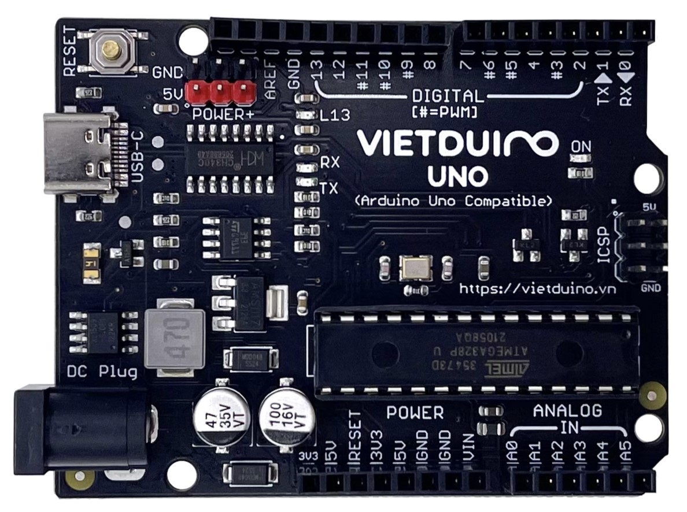

# Vietduino Uno (Arduino Uno Compatible)
## Giới thiệu sản phẩm
Vietduino Uno là bo mạch phát triển do MakerEDU nghiên cứu và sản xuất, dựa trên nguyên mẫu Arduino Uno, được nâng cấp toàn diện về phần cứng, hướng tới độ ổn định cao, hiệu suất tốt và độ bền lâu dài – đặc biệt phù hợp cho Giáo Dục STEM, Phòng Thí Nghiệm, Maker Space, nghiên cứu và phát triển ứng dụng nhúng cơ bản.
Mạch được thiết kế tương thích hoàn toàn với Arduino Uno về hình dạng, chuẩn chân tín hiệu và cách sử dụng, cho phép người dùng tận dụng trực tiếp toàn bộ hệ sinh thái Arduino: thư viện, ví dụ mẫu, shield và cộng đồng hỗ trợ.
## Ưu điểm nổi bật
- Tương thích hoàn toàn Arduino Uno, giữ nguyên form factor, vị trí chân và chuẩn giao tiếp, dễ dàng thay thế Arduino Uno trong các dự án hiện có.
- Nâng cấp mạch nguồn xung giảm áp hiệu suất chuyển đổi cao, tỏa nhiệt thấp, tiết kiệm năng lượng.
- Hỗ trợ dải điện áp đầu vào rộng: **6~24VDC**
- Dòng đầu ra lớn:
  - **5VDC: tối đa 1500mA**
  - **3.3VDC: tối đa 700mA**
- IC chuyển đổi USB–UART chính hãng
  - Sử dụng IC CH340, đảm bảo giao tiếp ổn định, nạp chương trình tin cậy và độ bền cao khi sử dụng lâu dài.
- Bảo vệ cổng USB máy tính
  - Tích hợp chức năng tự động cách ly nguồn USB khi cấp nguồn ngoài qua chân VIN hoặc jack DC, giúp tăng độ an toàn trong quá trình học tập và thử nghiệm.
## Thông số kỹ thuật
### Thông tin chung
- Model: Vietduino Uno (Arduino Uno Compatible)
- Vi điều khiển: ATmega328P-PU (Microchip)
- Điện áp hoạt động: 5VDC
- Điện áp đầu vào VIN: 6 ~ 24VDC
- Clock Speed: 16 MHz
### Bộ nhớ
- Flash Memory: 32 KB (0.5 KB dùng cho bootloader)
- SRAM: 2 KB
- EEPROM: 1 KB
### Dòng điện
- Dòng DC mỗi chân I/O: Tối đa 20 mA
- Dòng DC chân 3V3: Tối đa 700 mA
- Dòng DC chân 5V: Tối đa 1500 mA
### Giao tiếp & nạp chương trình
- IC USB–UART: CH340
- Cổng kết nối máy tính: USB-C hoặc USB-B
### Các chân tín hiệu
- Digital I/O: 14 chân(trong đó 6 chân hỗ trợ PWM)
- PWM: D3, D5, D6, D9, D10, D11
- Analog Input: 6 chân (A0 ~ A5)
- LED_BUILTIN: D13
### Kích thước
- Kích thước mạch: 68.6 × 53.34 mm
## Hướng dẫn sử dụng cơ bản với Arduino IDE
### Bước 1: Cài đặt Arduino IDE
- Tải và cài đặt phần mềm Arduino IDE từ trang chủ Arduino phù hợp với hệ điều hành đang sử dụng.
### Bước 2: Kết nối mạch với máy tính
- Kết nối Vietduino Uno với máy tính bằng cáp USB.
- Khi kết nối thành công, LED nguồn (ON) trên mạch sẽ sáng.
### Bước 3: Cài đặt driver CH340
- Vietduino Uno sử dụng IC CH340 để giao tiếp USB–UART.
- Nếu máy tính chưa nhận mạch, hãy cài đặt driver CH340 phù hợp với hệ điều hành.
### Bước 4: Cấu hình mạch trong Arduino IDE
Thực hiện các thiết lập sau trong Arduino IDE:
- Chọn loại board: Tools → Board → Arduino AVR Boards → Arduino Uno
- Chọn cổng kết nối (Port): Tools → Port → chọn cổng tương ứng với Vietduino Uno (Nếu chưa xác định được, hãy rút cáp USB và cắm lại để nhận diện cổng mới xuất hiện)
### Bước 5: Nạp chương trình thử nghiệm (Blink)
Sau khi cấu hình xong, bạn có thể nạp chương trình Blink để kiểm tra mạch.
Chương trình này sẽ làm LED_BUILTIN tại chân D13 chớp tắt mỗi 1 giây.

/*
  Blink
  Turns an LED_BUILTIN on D13 of Vietduino Uno for one second,
  then off for one second, repeatedly.
*/

void setup() {
  pinMode(13, OUTPUT);
}

void loop() {
  digitalWrite(13, HIGH);   // Bật LED
  delay(1000);              // Chờ 1 giây
  digitalWrite(13, LOW);    // Tắt LED
  delay(1000);              // Chờ 1 giây
}


Nhấn Upload (hoặc Sketch → Upload) để nạp chương trình.
Nếu LED D13 nhấp nháy đều, mạch đã hoạt động bình thường.

# Vietduino Uno (Arduino Uno Compatible)

## Giới thiệu

Mạch Vietduino Uno (Arduino Uno Compatible) được nghiên cứu và và sản xuất bởi MakerEDU dựa trên nguyên mẫu là mạch Arduino Uno với các ưu điểm vượt trội:

1. Thiết kế tương thích hoàn toàn về hình dạng, chuẩn chân tín hiệu và cách sử dụng với Arduino Uno.
2. Sử dụng mạch nguồn xung giảm áp với ưu điểm là hiệu suất chuyển đổi cao, toả nhiệt thấp, tiết kiệm năng lượng, dải điện áp đầu vào cấp cho mạch rộng từ 6~24VDC với dòng đầu ra lớn: 5VDC/Max 1500mA, 3.3VDC / Max 700mA.
3. Bổ sung thêm các chân cấp nguồn POWER+ 5VDC giúp dễ dàng cấp nguồn cho nhiều thiết bị khác nhau.
4. Sử dụng IC chuyển đổi USB-UART CH340 được nhập khẩu chính hãng cho độ ổn định và độ bền cao.
5. Chức năng cách ly nguồn cổng USB tự động khi cấp nguồn ngoài từ chân Vin hoặc giắc DC giúp bảo vệ cổng USB máy tính của bạn an toàn hơn.

## Thông số kỹ thuật

- **Model**: Vietduino Uno (Arduino Uno Compatible)  
- **Vi điều khiển**: ATmega328P-PU  
- **Điện áp hoạt động**: 5VDC  
- **Điện áp đầu vào VIN**: 6~24VDC  
- **Dòng DC đầu ra các chân I/O**: Max 20mA  
- **Dòng DC đầu ra chân 3V3**: Max 700mA  
- **Dòng DC đầu ra chân 5V**: Max 1500mA  
- **Flash Memory**: 32KB với 0.5 KB sử dụng cho bootloader  
- **SRAM**: 2KB  
- **EEPROM**: 1KB  
- **Clock Speed**: 16MHz  
- **IC nạp chương trình và giao tiếp UART**: CH340  
- **Cổng giao tiếp máy tính**: USB-C  
- **Kích thước**: 68.6 x 53.34mm  

## Hình ảnh sản phẩm




## Kích thước sản phẩm


## Các chân tín hiệu

- **Digital I/O**: 14 chân (với 6 chân có chức năng PWM)  
- **PWM Digital I/O**: 6 chân (D3, D5, D6, D9, D10, D11)  
- **Analog Input**: 6 chân (A0~A5)  
- **LED_BUILTIN**: D13  

## Hướng dẫn sử dụng với phần mềm Arduino

### Hướng dẫn sử dụng phần mềm Arduino cơ bản

[Hướng dẫn cài đặt phần mềm, nạp chương trình, cài đặt bộ thư viện Arduino cơ bản.](https://github.com/makerlabvn/Arduino-Vietduino)

- Tải và cài đặt [phần mềm Arduino tại đây.](https://www.arduino.cc/en/software)

### Hướng dẫn kết nối và nạp chương trình cho Mạch Vietduino Uno trên phần mềm Arduino

1) **Kết nối máy tính**: Kết nối Mạch Vietduino Uno với máy tính bằng cáp USB sẽ thấy Led nguồn ON trên mạch **phát sáng**:

[]()

2) **Cài đặt Driver**: Mạch Vietduino Uno mà một mạch Arduino Uno Compatible (tương thích Arduino Uno) sử dụng IC nạp chương trình và giao tiếp máy tính CH340, các bạn có thể tham khảo Hướng dẫn cài đặt Driver cho các mạch sử dụng IC giao tiếp USB-UART CH34x - MakerLab Wiki.
3) **Cấu hình mạch trên phần mềm Arduino**: Để cấu hình mạch trên phần mềm Arduino chúng ta cần làm các bước sau:

     Thiết lập Board tại **Tools > Board > Arduino AVR Boards > Arduino Uno và Port (cổng kết nối) cho mạch**, nếu không xác định được cổng kết nối có thể ngắt kết nối mạch và kết nối lại đồng thời kiểm tra phần Port để thấy cổng kết nối mới của mạch xuất hiện:  

[]()

Sau khi đã hoàn thành các thiết lập cơ bản bạn có thể nạp chương trình **Blink** sau vào mạch để test bằng cách nhấn vào nút **Upload** hoặc chọn **Sketch > Upload** sẽ thấy Led được kết nối với chân D13 trên mạch chớp tắt **1 giây 1 lần**:<br>

```ino
/*
  Blink
  Turns an LED_BUILTIN on D13 of Vietduino Uno for one second, then off for one second, repeatedly.
*/
// the setup function runs once when you press reset or power the board
void setup() {
  // initialize digital pin LED_BUILTIN on D13 as an output.
  pinMode(13, OUTPUT);
}

// the loop function runs over and over again forever
void loop() {
  digitalWrite(13, HIGH);  // turn the LED on (HIGH is the voltage level)
  delay(1000);                      // wait for a second
  digitalWrite(13, LOW);   // turn the LED off by making the voltage LOW
  delay(1000);                      // wait for a second
}
```

[]()

## Hỗ trợ và liên hệ

- Website: [https://www.makerlab.vn/](https://www.makerlab.vn/)
- Facebook: [https://www.facebook.com/makerlabvn](https://www.facebook.com/makerlabvn)

## Nhà phân phối

- Các bạn có thể mua sản phẩm của MakerLab tại các [Nhà Phân Phối.](https://www.makerlab.vn/distributor/)
